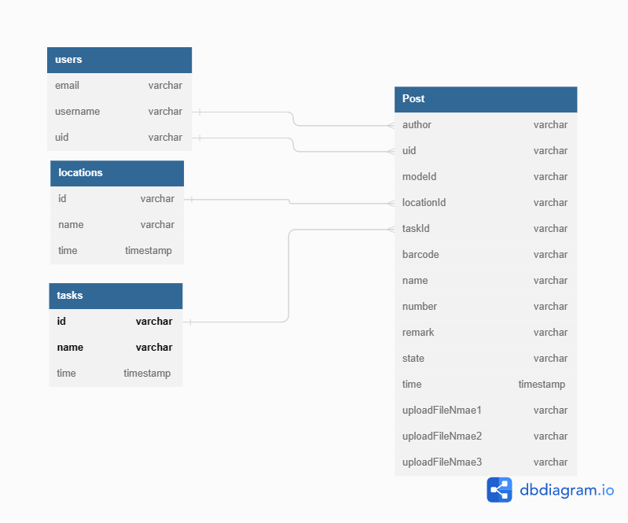

# 倉儲盤點 APP

<p float="left">
  
  
  
  
  
  
</p>

<p float="left">
  
  

  
  
  
  

</p>

## 開發相關

- 開發工具 Android Studio
- minSdkVersion 22
- targetSdkVersion 31
- Android Gradle Plugin Version 4.2.2
- Gradle Version 6.7.1

## 簡介

- 使用者註冊、登入系統
- 查看、新增、修改、刪除盤點資料
- 具備條碼掃描功能
- 使用者可依多種預設項目填寫
- 資料可附加手機內照片
- 資料庫內容會於手機連線時自動同步至遠端資料庫

## 使用套件

- [Firebase Database](https://firebase.google.com/docs/database)
- [Material Design](https://m2.material.io/develop/android)
- [FirebaseUI for Android](https://firebaseopensource.com/projects/firebase/firebaseui-android/)
- [Picasso](https://github.com/square/picasso)
- [ZXing Android Embedded](https://github.com/journeyapps/zxing-android-embedded)

```
<!-- 詳細版本如下 -->
com.google.guava:guava:31.1-jre
androidx.appcompat:appcompat:1.3.1
androidx.recyclerview:recyclerview:1.2.1
com.google.android.material:material:1.4.0
com.google.android.material:material:1.1.0-beta01
androidx.navigation:navigation-fragment-ktx:2.3.5
androidx.navigation:navigation-ui-ktx:2.3.5
com.leinardi.android:speed-dial:3.2.0

platform(com.google.firebase:firebase-bom:26.6.0)
com.google.firebase:firebase-database
com.google.firebase:firebase-database-ktx
com.google.firebase:firebase-auth
com.google.firebase:firebase-auth-ktx
com.firebaseui:firebase-ui-database:8.0.0
androidx.arch.core:core-runtime:2.1.0
com.google.firebase:firebase-storage:20.0.0
androidx.legacy:legacy-support-v4:1.0.0

com.karumi:dexter:6.2.3
com.squareup.picasso:picasso:2.71828
androidx.multidex:multidex:2.0.1
com.journeyapps:zxing-android-embedded:4.3.0
```

## 登入流程圖
.jpg)
## 盤點前置流程圖
.jpg)
## Database diagram design



## 資料庫架構

- 圖片已 PNG 格式儲存於 firebase storeage，檔名格式為`時間湊雜碼.png`,如`1628241139810.png`
- 倉儲資料已 JSON 格式儲存於 firebase realtime database，JSON root 目錄中分別有5個根節點
   * `users`一個以`User`組成的物件清單，以uid作為其鍵值，因此 `/users/<ID>/email` 就是uid為`<ID>`的User的電子郵件地址。格式如下
      ```
      {
          "使用者唯一id(英數混合30碼)" : {
            "email" : "使用者註冊email",
            "username" : "使用者註冊名"
          }
      }
      ```
   * `posts` - 以`Post`物件組成的清單, 以隨機產生的push ID作為鍵值.每個`Post`包含了`uid`和`authir`的屬性來決定如何辨識盤點者的身分而不需要JOIN-style的查詢，也包含了`modeId`、`locationId`和`taskId`來辨別此盤點位於何種模式、何種位置與任務。格式如下
      ```
      "倉儲資料識別碼" : {
        "author" : "編輯者名稱",
        "uid" : "編輯者id",
        "modeId" : "盤點模式id",
        "locationId" : "盤點位置id",
        "taskId" : "盤點任務id",
        "barcode" : "盤點碼",
        "name" : "品名",
        "number" : "數量",
        "remarks" : "備註",
        "state" : "物件狀態",
        "time": "盤點時間",
        "uploadFileName1" : "照片1id",
        "uploadFileName2" : "照片2id",
        "uploadFileName3" : "照片3id"
      }
      ```
    * `user-posts` - 用戶的盤點清單。 `/user-posts/<USER-ID>`是一個由特定用戶發表的所有帖子的清單，其鍵值與`posts`的push ID相同。 
    * `locations` - 盤點位置所組成的清單，其包含了`id`、`name`、`time`等屬性
    * `tasks` - 盤點任務所組成的清單，其包含了`id`、`name`、`time`等屬性


- `post`用於儲存倉儲資料，格式如下

```
    "倉儲資料識別碼" : {
      "author" : "編輯者id",
      "count" : "盤點數量",
      "format" : "單位",
      "location" : "位置",
      "name" : "品名",
      "number" : "帳上數量",
      "remarks" : "註記",
      "snumber" : "te7",
      "starCount" : 0,
      "uid" : "編輯者id",
      "unit" : "單位",
      "uploadFileName" : "照片id"
    },

    "-MgPj0IPPqCv51pcL4Y2" : {
      "author" : "power703",
      "count" : "4",
      "format" : "個",
      "location" : "i8",
      "name" : "熊",
      "number" : "5",
      "remarks" : "",
      "snumber" : "te7",
      "starCount" : 0,
      "uid" : "hMGvtJcv6bbb1znwvINRzcZZ7fj1",
      "unit" : "個",
      "uploadFileName" : "1628241139810.jpg"
    },
```
## Database Rules
以下是一些限制讀取以及規範有效資料的規則範例

```javascript

{
  "rules": {
    // User profiles are only readable/writable by the user who owns it
    "users": {
      "$UID": {
        ".read": "auth.uid == $UID",
        ".write": "auth.uid == $UID"
      }
    },

    // Posts can be read by anyone but only written by logged-in users.
    "posts": {
      ".read": true,
      ".write": "auth.uid != null",

      "$POSTID": {
        // UID must match logged in user and is fixed once set
        "uid": {
          ".validate": "(data.exists() && data.val() == newData.val()) || newData.val() == auth.uid"
        },

        // User can only update own stars
        "stars": {
          "$UID": {
              ".validate": "auth.uid == $UID"
          }
        }
      }
    },

    // User posts can be read by anyone but only written by the user that owns it,
    // and with a matching UID
    "user-posts": {
      ".read": true,

      "$UID": {
        "$POSTID": {
          ".write": "auth.uid == $UID",
        	".validate": "data.exists() || newData.child('uid').val() == auth.uid"
        }
      }
    },


    // Comments can be read by anyone but only written by a logged in user
    "post-comments": {
      ".read": true,
      ".write": "auth.uid != null",

      "$POSTID": {
        "$COMMENTID": {
          // UID must match logged in user and is fixed once set
          "uid": {
              ".validate": "(data.exists() && data.val() == newData.val()) || newData.val() == auth.uid"
          }
        }
      }
    }
  }
}
```

<!-- ## 展示影片

[Youtube 連結](https://youtu.be/LMsfWJopg8k) -->

## 預計增加功能

- [x] 制定目錄樹分類（倉庫、區、排、位置）
- [ ] 可自訂項目欄位模板（目前是預設）
- [x] 可附加多張照片
- [ ] beta 版上架 play 商店
